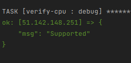
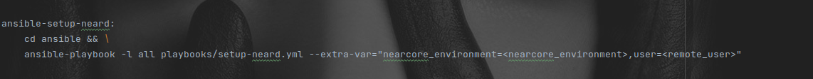
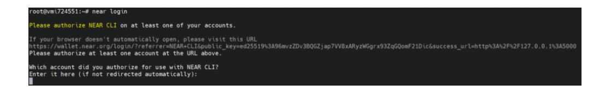
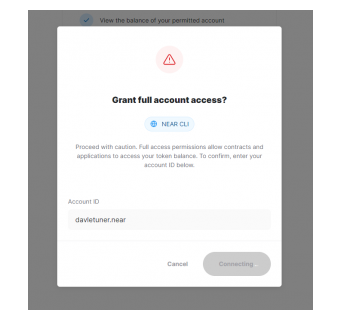

# Install Ansible
Install ansible on you local machine. e.g Debian and Ubuntu linux.
```
apt install ansible 
```
Help link for ansible installation on other OS.
_https://docs.ansible.com/ansible/latest/installation_guide/intro_installation.html_

Enter the remote host IP of the instance in inventory.yml, the inventory.yml file should be located in the root of the ansible directory.

Copy the ssh private-key.pem for the host to into the ssh directory.

Enter the key's name _private_key_file  = ../ssh/<private-key.pem>_ ansible.cfg in the ansible directory. 

Check to see if the remote host can be reached with the command **_make ansible-ping_**

You will see a success output on your terminal if the host is reachable.


# Verify Cpu
Verify that CPU meets minimum requirements before Near installation.
Run the command below to verify if the host meets up with minimum requirements.

Supported message will be shown, if host passes verification.



```
make ansible-verify-cpu
```
If host passes the verification test, proceed with the Near installation.

# Install Near dependencies
Install dependencies needed to setup near environment. 
```
make ansible-deps
```

# Install node and node cli
Install node and node cli on the host.
```
make ansible-node
make ansible-near-cli
```

# Setup nearcore
This process git clones the nearcore project and compiles nearcore binary.

Define the _nearcore_environment_, _user_ variable in the **Makefile**, _nearcore_environment_=_shardnet_, _user_=<remote_user>.


```
make ansible-nearcore
```


# Setup and run neard
Setup neard service.
```
make ansible-setup-neard
```


# Initialize working directory
In order to work properly, the NEAR node requires a working directory and a couple of configuration files. Generate the initial required working directory by running:

Login to the Host and replace the config.json file

**config.json** - Configuration parameters which are responsive for how the node will work. The config.json contains needed information for a node to run on the network, how to communicate with peers, and how to reach consensus. Although some options are configurable. In general validators have opted to use the default config.json provided.

**genesis.json** - A file with all the data the network started with at genesis. This contains initial accounts, contracts, access keys, and other records which represents the initial state of the blockchain. The genesis.json file is a snapshot of the network state at a point in time. In contacts accounts, balances, active validators, and other information about the network.

**node_key.json** - A file which contains a public and private key for the node. Also includes an optional account_id parameter which is required to run a validator node (not covered in this doc).

**data/** - A folder in which a NEAR node will write it's state.

Be sure to add this parameter to the config.json if missing: _**"external_address": ""**_

**_boot_nodes_**: If you had not specified the boot nodes to use during init in Step 3, the generated config.json shows an empty array, so we will need to replace it with a full one specifying the boot nodes.

Ensure this field parameter is set to 0 "tracked_shards": [0]

# Activating the node as validator
Authorize Wallet Locally

A full access key needs to be installed locally to be able to sign transactions via NEAR-CLI.

You need to run this command:
```
near login
```
Note: This command launches a web browser allowing for the authorization of a full access key to be copied locally.

1 – Copy the link in your browser


Enter your wallet id into the terminal and press Enter

Run the following command:
```
cat ~/.near/validator_key.json
_Note: If a validator_key.json is not present, follow these steps to create one**_
```

# Create a validator_key.json

Generate the Key file:
```
near generate-key <pool_id>
<pool_id> ---> xx.factory.shardnet.near WHERE xx is you pool name
```

Pool will be created at the next task, now you can give the same name as your wallet name


For example :
wallet name : john.shardnet.near (in future we will call it ) pool name : john.factory.shardnet.near
Please use the same pool name for next task "Mount your Staking Pool"

Copy the file generated to shardnet folder: Make sure to replace <pool_id> by your pool name
```
cp ~/.near-credentials/shardnet/YOUR_WALLET.json ~/.near/validator_key.json
```

Edit “account_id” => xx.factory.shardnet.near, where xx is your PoolName

Change private_key to secret_key
Note: The account_id must match the staking pool contract name or you will not be able to sign blocks.\

File content must be in the following pattern:

{
  "account_id": "xx.factory.shardnet.near",
  "public_key": "ed25519:HeaBJ3xLgvZacQWmEctTeUqyfSU4SDEnEwckWxd92W2G",
  "secret_key": "ed25519:****"
}

#Start the validator
```
sudo service neard start
```


# Stake near pool
Near staking pool, this step should be after activating the node as a validator.
```
make ansible-setup-validator
```